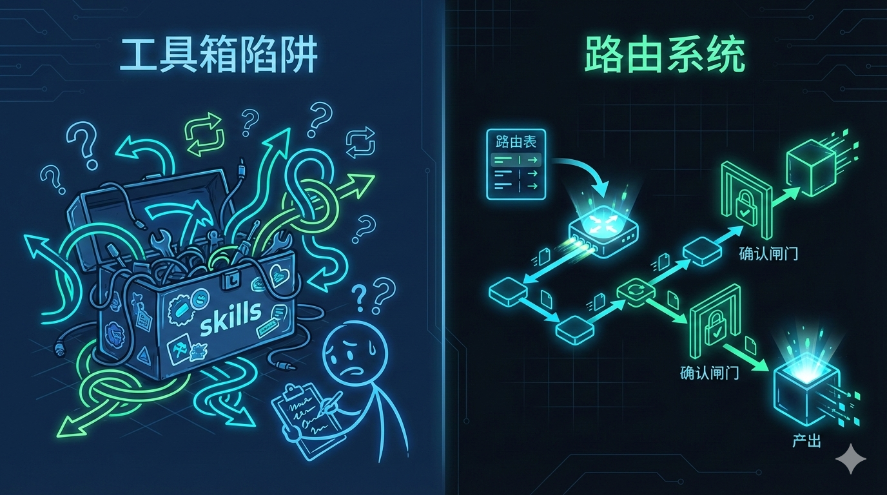
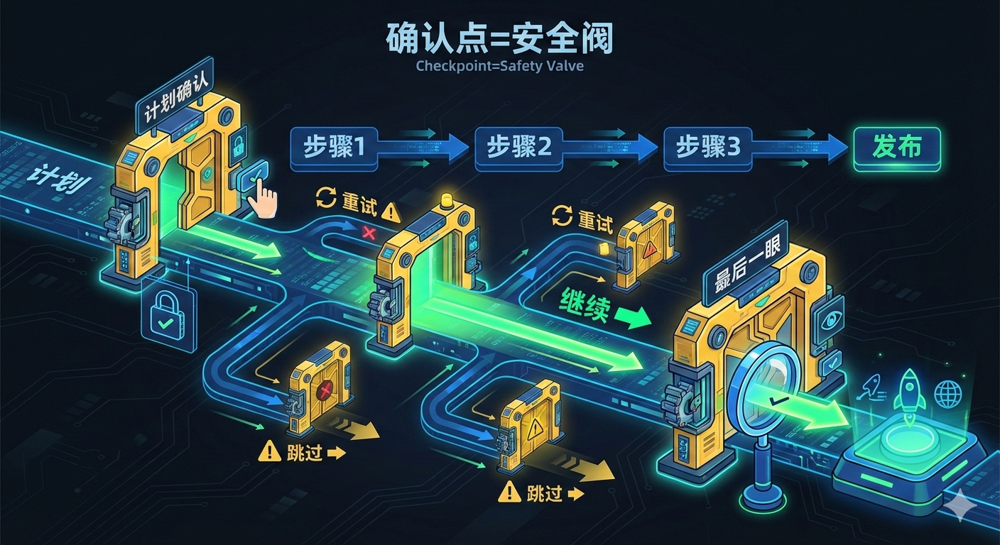
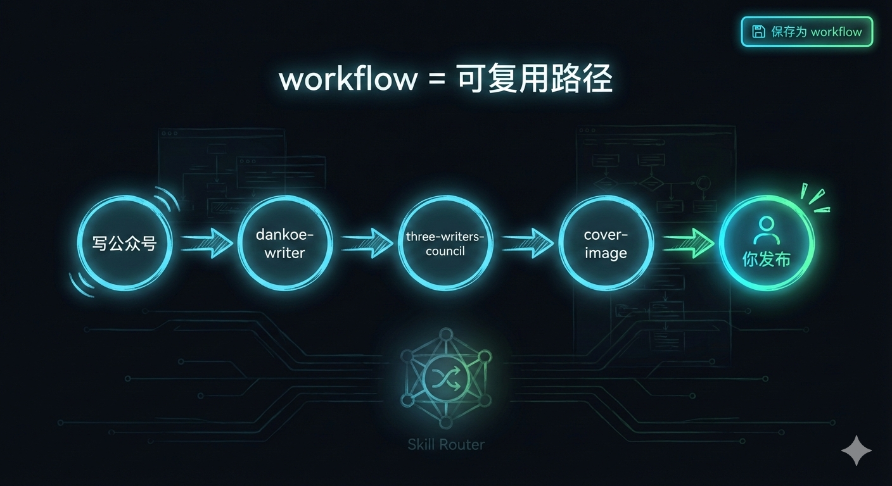

### 最终标题
- 你缺的不是更多技能，而是一张“技能路由表”：Skill Router 如何把 AI Agent 变成稳定交付系统


### 摘要（3-5 条）
- 很多 AI 工作流翻车，不是模型不行，而是你每次都在“现场指挥”，顺序、输入、回滚全靠脑子扛。
- Skill Router 把每个 `SKILL.md` 当成技能的“自我介绍”，扫描后汇总成一张可查的清单（路由表），让 Agent 先查表再开工。
- 两阶段加载（先 `export --brief`，需要时再 `show`/读取完整 `SKILL.md`）是控 token、控注意力、控稳定性的关键。
- workflow 把高频任务固化成路径：写稿→打磨→封面→（发布你自己把关），让“每次像第一次”变成“每次都差不多稳”。
- 真正的提升往往来自组织方式：资产清单、执行顺序、确认闸门，而不是换一个更贵的模型。

### 正文

你可能也有过这种体验：

技能装了一堆，模型也不差。  
可一到真要交付——写公众号、出配图、准备发布——质量就开始飘。

有时候一把过。  
更多时候卡在中间：结构散、口吻怪、该配图的地方没配、该确认的点没确认，最后你还是得亲自收拾残局。

我后来越来越确定一件事：问题通常不在“你缺一个新技能”，而在“你没有一条稳定的路”。

这篇文章 8-10 分钟，我想讲 6 件事：为什么你总在翻车，以及 Skill Router 这种“查表再执行”的方式怎么把下限抬起来。

---

一、你以为你在用技能，其实你在当调度员

多技能 Agent 真正消耗你的地方，不是执行那一下，而是执行之前和之后：

- 这次该用哪几个？
- 顺序怎么排？
- 哪一步要跳过？
- 失败了怎么回滚？从哪一步重来？

你会发现：你做的不是“使用工具”，你做的是“给工具写临时 SOP”。

更糟的是，这套 SOP 只活在你的脑子里。第二天、下周、下个月，又得重新想一遍。



一句话总结就是：能跑 ≠ 能交付。能交付的前提是路径可重复。

---

二、Skill Router 做的事很朴素：先把“我有什么”搞清楚

Skill Router 本质上是个 CLI：发现、注册、管理 skills。

它的思路很像网络路由：  
skills 是节点，registry 是路由表，执行前先查表。

更关键的是：它把 `SKILL.md` 当作技能的“协议”，而不是一段随便写写的说明。

一个好用的 skill，至少要把这些说清楚：

- 你是谁（id/name）
- 你能干什么（description）
- 你要什么输入（inputs）
- 你会产出什么（outputs）
- 你怎么跑（步骤）

Skill Router 会把这些东西扫出来、记下来，最后你能用一条命令看到自己到底有哪些能力：

```bash
skill-router list
```

当“能力清单”可见之后，很多事就不再靠记忆和感觉。

---

三、两阶段加载：别把所有东西一次性塞进上下文

我见过很多人把 Agent 提示词越写越长，最后写成一部说明书。结果不是更稳，反而更漂。

原因很直白：信息越多，注意力越分散。尤其是 skills 多的时候，把每个技能的完整 `SKILL.md` 全塞进去，基本等于让模型在一堆细节里找针。

Skill Router 的推荐姿势更现实：

1) 先给精简路由表（几千 token 就能装下很多 skills）：

```bash
skill-router export --brief
```

2) 真要用某个 skill，再去拿它的完整说明：

```bash
skill-router show <skill-id>
# 然后读取输出的 manifest 路径里的 SKILL.md
```


这不是“偷懒”。这是把信息当成可检索结构来管理。

---

四、确认机制不是拖慢，是把风险卡在闸门里

内容生产/发布属于高风险动作：标题承诺没兑现、语气不合适、事实不严谨、图片风格不搭……一次误发带来的损失，远大于多点一次确认。

Skill Router 作为“元技能”有个很硬的流程（我很喜欢这一点）：

- 先列出技能清单
- 再给执行计划
- 用户确认后才开始跑
- 每一步跑完都问：要不要继续下一步



你可以觉得它啰嗦，但它确实把“可控”写进了流程里。

---

五、workflow：把“高频任务”固化成一条路

真正有价值的不是“这次写得不错”，而是“下次也能不错，并且成本更低”。

workflow 就是把多步组合固化下来：你说一句触发词，它就把路径摆出来给你确认。

比如公众号常见路径：

- `dankoe-writer`：先出一个结构强的初稿
- `three-writers-council`：再用“三人议会”把它打磨得更像公众号
- `baoyu-cover-image`：生成封面
- 发布：我强烈建议像你这次一样，最后一步你自己把关



你会明显感觉：一旦路径固定了，很多“重复内耗”会消失。

---

六、你真正要管理的是系统，而不是模型

换模型能提高上限，但你天天交付时，折磨你的更多是下限：

- 输入不清楚
- 步骤不清楚
- 失败没预案
- 确认点放错地方

Skill Router 这种工具的价值就在于：它把“组织方式”做成了结构——清单、路径、确认、导出。

说白了就是：你开始像管理系统一样管理 AI。

---

### 实践协议（如适用）

第一：把技能资产清点一遍（10-30 分钟）
- 首次安装与使用：
  - `cd skill-router && npm install && npm link`
- 深度扫描并建立清单：
  - `skill-router init --deep`
  - `skill-router list`

第二：用两阶段加载把稳定性拉回来（5 分钟）
- `skill-router export --brief`
- 真要用哪个，再 `skill-router show <id>` 取路径，按需读完整 `SKILL.md`

第三：把你的高频任务做成 workflow（10 分钟）
- 先写出你真实会走的路径：A → B → C（别理想化）
- 再把它保存下来（按你的习惯写 triggers）

第四：把确认点放对（长期收益）
- 执行前确认方向：读者是谁、要达成什么、禁区是什么
- 执行中每步确认：继续/重试/跳过
- 发布前最后一眼：永远由你自己来

---

### 结尾（强收束 + CTA）

如果你现在的 AI 工作方式是：不断加技能、不断加提示词、不断加“自动化步骤”——你很可能会越加越乱。

试试反过来：先把清单做出来，再把路径固化下来。

评论区我想问你一个更具体的问题：  
你最想系统化的那件事是什么？它现在卡在哪里——卡在选题、结构、还是“下一步不知道做什么”？

现在就做（3 分钟）：  
写下你那件事的一条路径，用一行写成：`skill1 → skill2 → skill3`。这就是你下一条 workflow 的雏形。

---

### 可拆分内容（8-12 条，适配 X/朋友圈/社群）

1. 你缺的不是更多技能，你缺的是一条能稳定走到结果的路。
2. 多技能 Agent 最耗人的是：每次都要重新排顺序、重新交代输入、重新兜底失败。
3. 先把 skills 变成清单（路由表），再谈自动化。
4. 上下文别当仓库用：先 `export --brief`，需要时再按需读完整 SKILL。
5. 自动化要可控：确认点就是闸门。
6. workflow 的意义：把高频任务固化成路径，少一点临场发挥。
7. 换模型能提上限，但流程能抬下限。
8. 真正让你稳定交付的，是“组织方式”，不是“某个神技能”。
